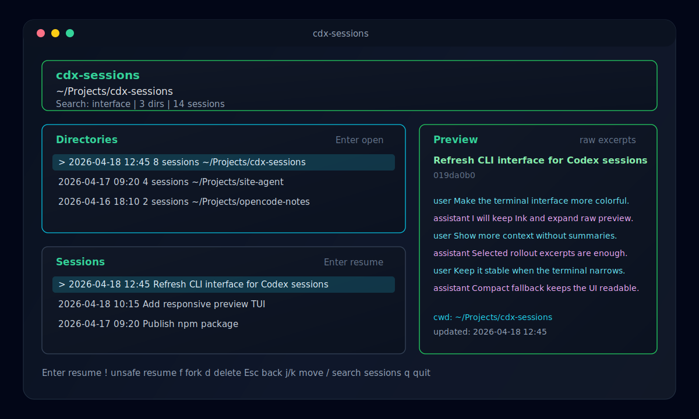
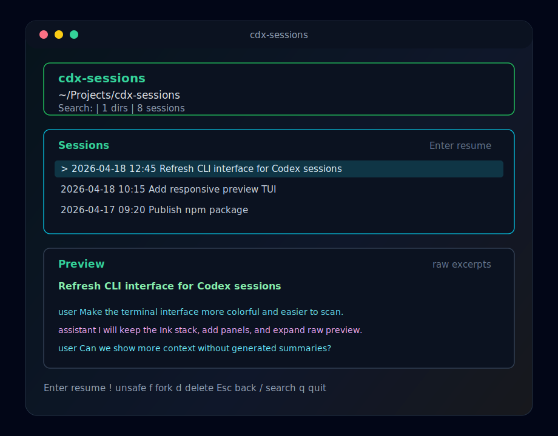

# cdx-sessions

<p align="center">
  <strong>A polished terminal workspace for finding, previewing, and resuming local Codex sessions.</strong>
</p>

<p align="center">
  <a href="https://www.npmjs.com/package/cdx-sessions"></a>
  <a href="https://github.com/golovpeter/codex-cli-session-manager/actions"></a>
  
  
</p>

`cdx-sessions` is a keyboard-first TUI for navigating Codex sessions across project directories without opening the Codex desktop app. It reads your local Codex session metadata, groups sessions by working directory, shows a lightweight raw preview, and delegates continuation back to the official Codex CLI.

```bash
npm install -g cdx-sessions
cdx-sessions
```

## Preview

<p align="center">
  
</p>

<p align="center">
  
</p>

## Why Use It

- Browse all local Codex sessions from one terminal UI.
- Start from a project directory, then pick the session inside it.
- See a raw, non-generated preview of recent session context before resuming.
- Resume, fork, delete, or run an unsafe resume with explicit confirmation.
- Hide delegated subagent sessions by default to keep the list focused.
- Works well in both wide and narrow terminals.

`cdx-sessions` does not rewrite Codex history, does not summarize conversations with an LLM, and does not display full session transcripts.

## Install

From npm:

```bash
npm install -g cdx-sessions
cdx-sessions
```

From a local checkout:

```bash
npm install
npm run build
npm link
cdx-sessions
```

After `npm link`, future source changes usually only need:

```bash
npm run build
cdx-sessions
```

Run without linking:

```bash
npm run build
node dist/cli.js
```

## Usage

```bash
cdx-sessions [options]
```

Common options:

```bash
cdx-sessions
cdx-sessions --cwd ~/Projects/cdx-sessions
cdx-sessions --include-subagents
cdx-sessions version
```

When you resume or fork a session, `cdx-sessions` launches the official Codex CLI command:

```bash
codex resume <session-id>
codex fork <session-id>
```

Unsafe resume is also available from the session screen. It asks for confirmation before launching:

```bash
codex --dangerously-bypass-approvals-and-sandbox resume <session-id>
```

## Keyboard

| Key | Directory screen | Session screen |
| --- | --- | --- |
| `Enter` | Open directory | Resume session |
| `!` | - | Resume without approvals or sandbox |
| `f` | - | Fork session |
| `d` | - | Delete session with confirmation |
| `/` | Search directories | Search sessions |
| `j` / `Down` | Move down | Move down |
| `k` / `Up` | Move up | Move up |
| `Esc` / `Backspace` / `b` | - | Back to directories |
| `q` | Quit | Quit |

Deleting a session removes its row from `session_index.jsonl` and removes the selected rollout file when one is available. Confirmation uses `Enter`; cancel with `Esc` or `n`.

## Session Discovery

`cdx-sessions` reads local Codex metadata from:

```text
~/.codex/session_index.jsonl
~/.codex/sessions/**/*.jsonl
~/.codex/archived_sessions/**/*.jsonl
```

The reader uses `session_meta` records for metadata such as session id, working directory, timestamp, Codex CLI version, and model provider. Rollout files are treated as external input and parsed defensively.

## Safety And Privacy

- Session previews are raw excerpts from local rollout files, not generated summaries.
- Preview length is bounded so full transcripts are not printed by default.
- Delete and unsafe resume both require explicit confirmation.
- Resume and fork are delegated to the official Codex CLI.

## Development

```bash
npm install
npm run dev
npm test
npm run typecheck
npm run lint
npm run build
```

Quality gates:

- `npm run lint` checks TypeScript with ESLint.
- `npm test` runs Vitest unit tests.
- `npm run typecheck` runs TypeScript without emit.
- `npm run build` creates the publishable `dist` output.

## Stack

- Node.js `>=20`
- TypeScript ESM
- Ink + React
- Commander.js
- Execa
- Zod
- Vitest

## Contributing

Contributions are welcome. See [CONTRIBUTING.md](./CONTRIBUTING.md) for local setup, coding guidelines, and release notes.

## License

MIT
